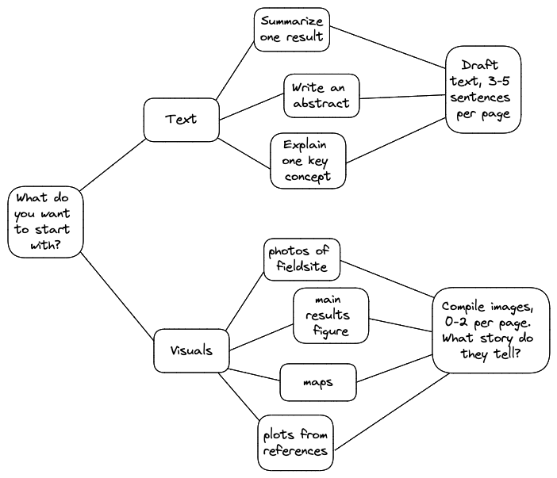
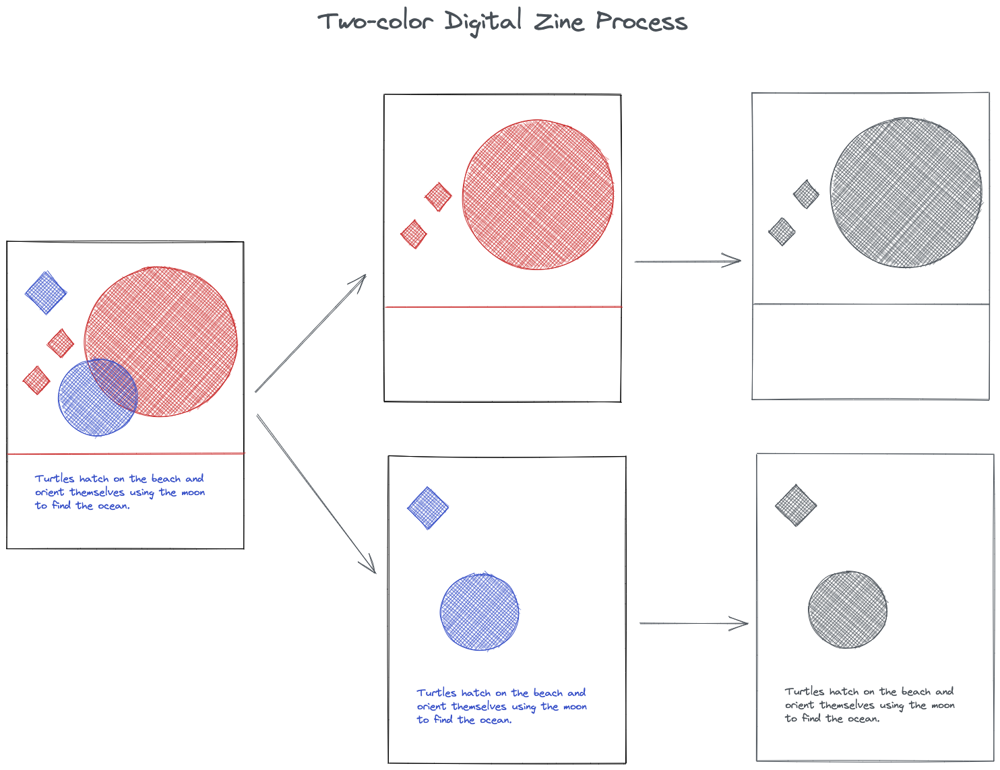
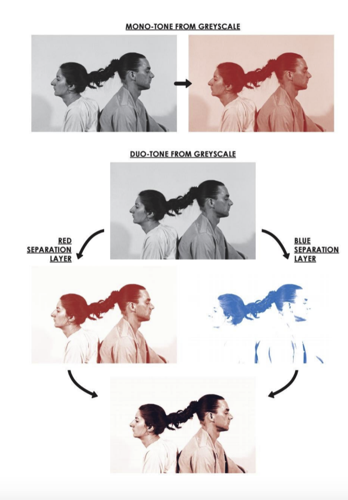
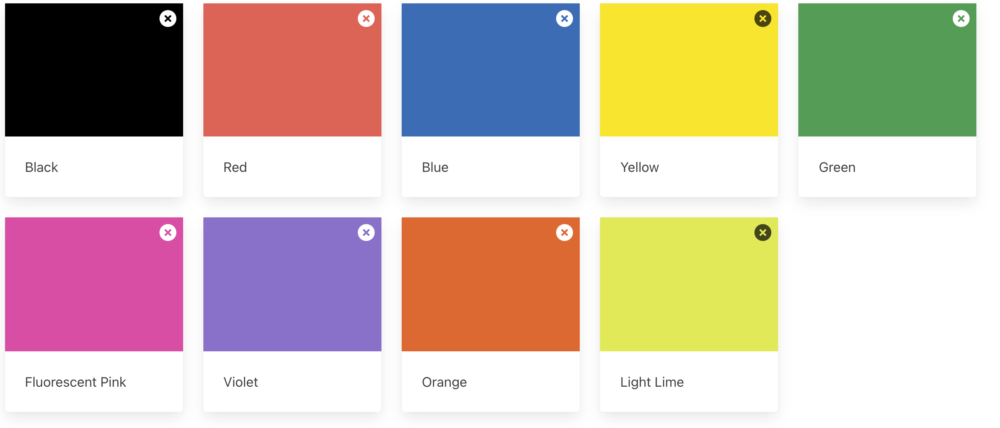
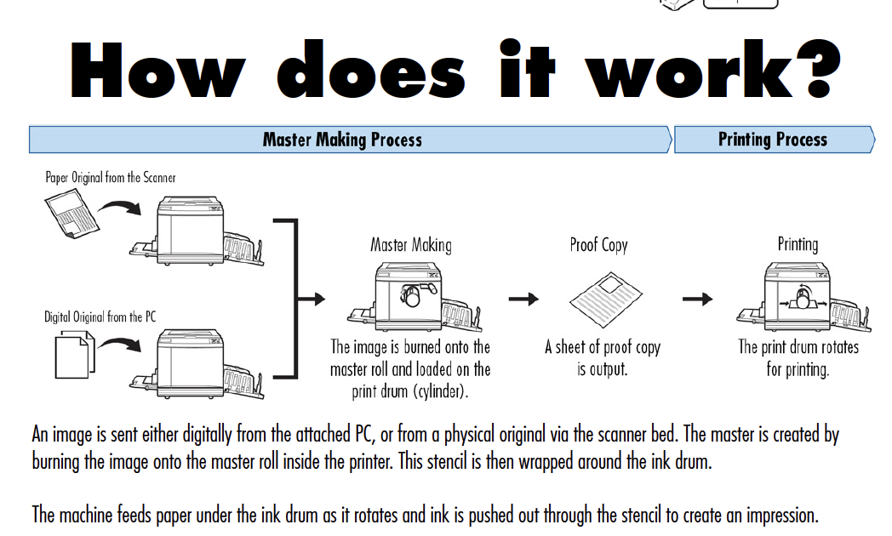

These resources are for a zine workshop currently being run at Columbia University in partnership with Nathan Lenssen and his course on "Climate CHange Impacts on Humans in New York City." That said, feel free to use and adapt these resources if they are useful to you!

# Workflow
You can create the zine however you want using whatever materials you want! That's the beauty of zines in general -- anyone can make one, with whatever supplies they have on hand. For the sake of our short timeline, we've created a couple of workflows: one analogue, one digital. These will be rough and general guides to the ideation, creation, and compilation of your zine.

But first! Where do you even start?

The above chart gives you a couple of examples of how you might be able to begin drafting your zine, though these are just ideas and not meant to be restrictive. Because a zine tends to be quite short, it will probably be useful to choose a subtopic or single experience to focus on. This is part of the learning goal of this zine: how do we hone, focus, give time to, build a relationship with an idea, experience, or concept, when the whole (e.g. the climate crisis) is so massive it becomes what Timothy Morton refers to as a [hyperobject](https://www.hcn.org/issues/47.1/introducing-the-idea-of-hyperobjects)? 

The zine should include both **visual** and **textual** components. 

**What images best narrate your story? What choice of words conveys your message in just a few sentences?**

## Analogue Zines (one color only)

You can make your zine with pen and paper (optional materials: gluestick, scissors, stapler, collage materials, rubber stamps, pastels, paints, highlighters, etc)

1. Draft your text or choose your images. How many pages do you want your zine to be? (Remember: multiple of 4! )
2. Gather materials: you will need printer paper (# pages/4), something to write with, any collage materials you want to use
3. Fold each piece of printer paper in half, hamburger style (matching 8.5" edges). Put one inside the other, so that you have one page as the binding, and the rest Russian-dolled inside.
4. Number the pages from front to back. Don't staple them yet!
5. Congrats! You now have a blank zine to begin filling in.
6. You can use different textures and color values, but remember --**light colors and light values (e.g. light grey, yellow) will not show up on the riso print.** We recommend doing your zine in all black or dark grey, using textures and patterns instead of color and color value to add different dimensions to your visuals. See the RISO section for more information. 
7. Once you have written your zine and added in your visuals, you will scan each page into the computer. 
8. You can view the zine in your chosen color using the Spectrolite App. 

## Digital Zines (one or two colors only)

1. Draft your text or choose your images. How many pages do you want your zine to be? 
2. The powerpoint template has been designed to be flexible. The front and back pages are labeled. Copy the template for the middle page as many times as you need (so that the number of pages = front + back + # of middle pages)
	- Note! The borders are there for a reason! Don't put anything between the borders and the edges of the canvas! It won't print!
3. Add in images, text, and other visual elements. Remember --**light colors and light values (e.g. light grey, yellow) will not show up on the riso print.** We recommend creating your zine in all black or dark grey, using textures and patterns instead of color and color value to add different dimensions to your visuals. See the RISO section for more information. 
4. If you want a two-color zine, you will have to separate your text & images by color into two separate documents. We recommend making one main version of your zine, and then duplicating that version twice. Name each duplicate version as {CUID}\_ZINE\_{COLOR}. Delete any instances of text and images of the other color from the file. Each file should then be saved in greyscale before sending it to us.

# Zine requirements
- Relates in some way to your research for this course
- Number of pages is a multiple of 4 (4, 8, 12, 16, max 20) including front and back. 
- Each page will be 5.5" x 8.5" (half-letter-size)
- If you want your zine professionally printed, you will only be able to print in 1 color (analogue) or 1-2 colors (digital) (see note on RISO below)

# Submission for compilation

Suki and Elizabeth can help with compiling the zines into the InDesign template. If you would like your zines printed for the final project presentation day, you will need to submit the materials below by **April 10** to ensure the zines can be **delivered to the printer on April 15**. (We know the turnaround time is quick! Talk to us if you need more time!). You can also compile your zine in InDesign yourself using the template we provide. See below.

- Number of pages (multiple of 4!)
- Analogue zines
	- PDF of scanned zine, where each page of the pdf is 1 page of your zine savd as `{CUID}\_ZINE_{COLOR}`
	- Color (black, red, blue, yellow, green, fluorescent pink, violet, orange, light lime)
- Digital zines
	- Either .pptx files separated by color saved as `{CUID}\_ZINE\_{COLOR}`
	OR
	- Text separated by pages (.doc, .txt, .md)
	- Font indicated for each section/page (or whole document)
	- Image files (png or svg preferred) saved as `{CUID}\_IMGp{PAGENUMBER}`
	- Layout in powerpoint or on paper (we will try to stay true to this as much as possible!)
	- Color (black, red, blue, yellow, green, fluorescent pink, violet, orange, light lime)

## Compiling your own submission in InDesign

If you choose to compile the zine in InDesign, please use the template and submit the **.indd** file to us by **April 14** if you would like the zine printed for the final presentation date. Make sure to specify the color and double check the page order; we are happy to consult ahead of time but won't be checking your files after April 14 in order to ensure we can get everything to the printer on time.

InDesign is available on all computers in the Schermehorn computer lab.

# Notes on riso printing

Riso printing is a process for creating many duplicates from a master stencil. It was original designed to produce lots of copies for offices (or religious institutions, or schools), but has been somewhat recently adopted by printers because of its a) cheapness, b) aesthetics, c) color quality, and d) speed. 

You can find out more about [the basics of riso printing here](https://issuu.com/lieselloplop/docs/riso_guide_partisan_2018), but here's what you need to know for this project:

- Riso printing depends on the color [VALUE](http://char.txa.cornell.edu/language/ELEMENT/COLOR/color.htm), aka how light or dark it is. Because you are going to choose one color (or two), it is the lightness/darkness of the grey-value of an image or text that determines the opacity of the color as it gets printed
	- Basically, unless/even if you're doing a 2-color digital zine and want to mix colors, make sure you do your work in **black** or **dark grey** ink/color. If you're using images from elsewhere, or plots, make sure that they will be visible/legible without colors to differentiate the different parts of the image.
	- If you're doing a 2-color zine, the colors will mix (often to very cool effect!) depending on the lightness or darkness of that color when it prints. Think about that mixing when you are designing your zine! Overlap is good!
	- This can be kind of confusing -- here is a visual example of a photograph printed in red, and a photograph separated into two colors and printed, which mixes those colors.

- Riso printers have a set number of colors available for us to use. In our case, our printer has the following colors: black, red, blue, yellow, green, fluorescent pink, violet, orange, light lime.
	- If you are interested in 2 color printing, and the effects of mixing, we recommend you download the [Spectrolite App](https://spectrolite.app/), which is free. It was designed by a pair of printmakers, and can help you visualize how your zine will look printed in 1 or more colors. The .iso file for the colors from our printshop is available in the github.

## How does a Riso Work?

## Here are a few images of Riso prints. 

*From to to bottom:*
*2-color riso print by Leanna McAlpine
1-color print from Genderfail
1-color zine by Amelia Greenhall*

